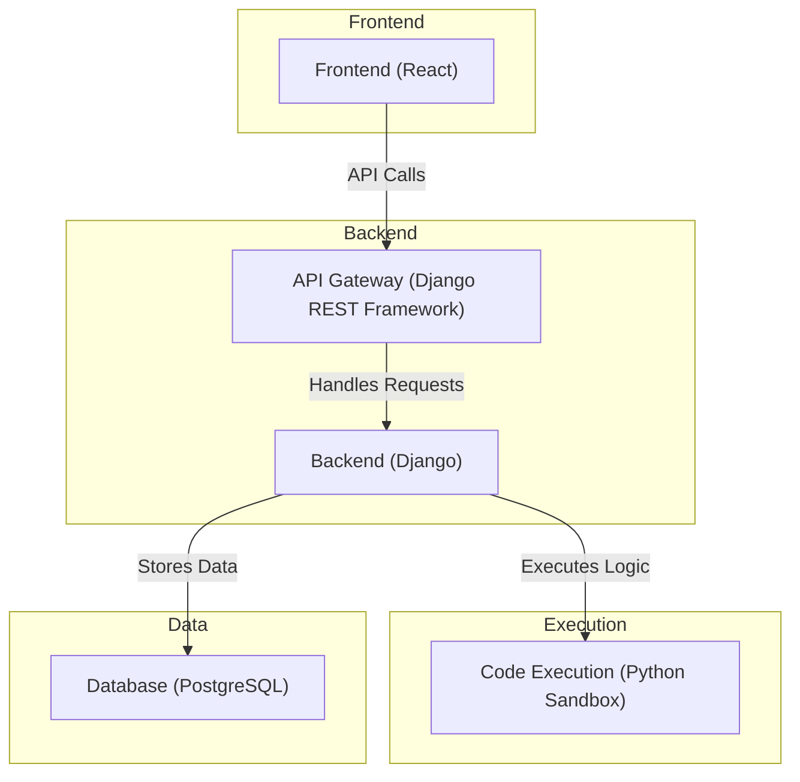
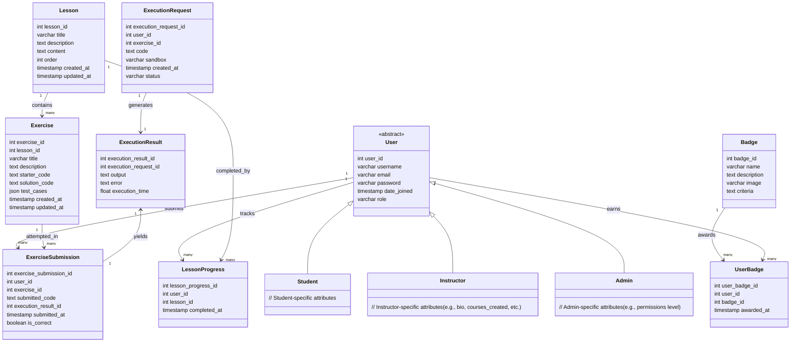

# icpp-dev-mode

# sYs aRcH sMpL

```mermaid
graph TD;
    A["Frontend (React)"] -->|API Calls| B["API Gateway (Django REST Framework)"];
    B -->|Handles Requests| C["Backend (Django)"];
    C -->|Executes Logic| D["Code Execution (Python Sandbox)"];
    C -->|Stores Data| E["Database (PostgreSQL)"];


    subgraph Frontend
        A
    end

    subgraph Backend
        B
        C
    end

    subgraph Execution
        D
    end

    subgraph Data
        E
    end
```

```mermaid
classDiagram
    %% Supertype: User
    class User {
      <<abstract>>
      int user_id
      varchar username
      varchar email
      varchar password
      timestamp date_joined
      varchar role
    }
    
    %% Subtypes
    class Student {
      // Student-specific attributes
    }
    class Instructor {
      // Instructor-specific attributes (e.g., bio, courses_created, etc.)
    }
    class Admin {
      // Admin-specific attributes (e.g., permissions level)
    }
    User <|-- Student
    User <|-- Instructor
    User <|-- Admin

    %% Lesson and Exercise
    class Lesson {
      int lesson_id
      varchar title
      text description
      text content
      int order
      timestamp created_at
      timestamp updated_at
    }
    class Exercise {
      int exercise_id
      int lesson_id
      varchar title
      text description
      text starter_code
      text solution_code
      json test_cases
      timestamp created_at
      timestamp updated_at
    }
    Lesson "1" --> "many" Exercise : contains

    %% Execution Request and Result
    class ExecutionRequest {
      int execution_request_id
      int user_id
      int exercise_id
      text code
      varchar sandbox
      timestamp created_at
      varchar status
    }
    class ExecutionResult {
      int execution_result_id
      int execution_request_id
      text output
      text error
      float execution_time
    }
    ExecutionRequest "1" --> "1" ExecutionResult : generates

    %% Badge and UserBadge
    class Badge {
      int badge_id
      varchar name
      text description
      varchar image
      text criteria
    }
    class UserBadge {
      int user_badge_id
      int user_id
      int badge_id
      timestamp awarded_at
    }
    Badge "1" --> "many" UserBadge : awards
    User "1" --> "many" UserBadge : earns

    %% Lesson Progress
    class LessonProgress {
      int lesson_progress_id
      int user_id
      int lesson_id
      timestamp completed_at
    }
    User "1" --> "many" LessonProgress : tracks
    Lesson "1" --> "many" LessonProgress : completed_by

    %% Exercise Submission
    class ExerciseSubmission {
      int exercise_submission_id
      int user_id
      int exercise_id
      text submitted_code
      int execution_result_id
      timestamp submitted_at
      boolean is_correct
    }
    User "1" --> "many" ExerciseSubmission : submits
    Exercise "1" --> "many" ExerciseSubmission : attempted_in
    ExecutionResult "1" <-- "1" ExerciseSubmission : yields
```
